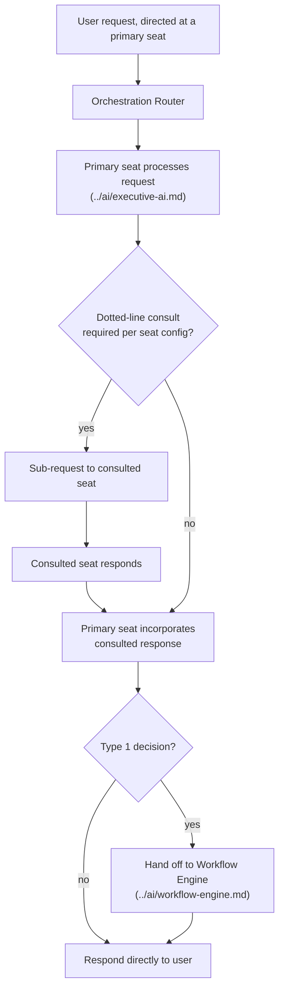

# Agent Orchestration

How multiple AI Workforce seats collaborate on a single request — the technical implementation of the "dotted-line consult" pattern already defined in [`ai-agents/workforce/README.md`](../../ai-agents/workforce/README.md).

## Orchestration Pattern

**Decision: a deterministic router, not a fully autonomous multi-agent-decides-everything pattern.**

Justification: [`ai-agents/workforce/README.md`](../../ai-agents/workforce/README.md)'s Ground Rules already specify exactly which seats consult which others and when (reporting lines, dotted lines) — this is a known routing table, not a problem requiring an LLM to figure out dynamically who should be involved. A deterministic router is more predictable, cheaper, faster, and easier to audit than letting a model decide agent-to-agent routing at runtime.

## Example: Grant Proposal Requiring Multi-Seat Review

Matches [`ai-agents/workforce/grant-writer.md`](../../ai-agents/workforce/grant-writer.md)'s documented decision authority exactly:

1. User asks the **Grant Writer** seat to draft a funding proposal for RecoverHUB.
2. Grant Writer seat drafts content, pulling evidence via a sub-request to **Chief Research Officer** (dotted line).
3. Before the proposal can be marked ready for submission, the router requires sign-off sub-requests to **CFO** (financial terms) and **Chief Legal Officer** (binding terms) — per the seat's own documented Type 1 boundary.
4. Only once all three respond does the workflow (see [`workflow-engine.md`](./workflow-engine.md)) mark the proposal submission-ready.

## Guardrails

| Guardrail | Purpose |
|---|---|
| Maximum consultation depth (e.g., 3 hops) | Prevents runaway agent-to-agent chains from a misconfigured or unusual request |
| Per-request cost cap | Bounds LLM Gateway spend for any single orchestrated request (see [`ai-platform.md`](./ai-platform.md)) |
| Timeout per sub-request | A slow or failed consulted seat doesn't hang the primary seat's response indefinitely — degrade gracefully (respond with what's available, flag the missing consult) rather than blocking |
| Human escalation path | Any orchestration failure (e.g., conflicting seat recommendations) surfaces to a human via the Workflow Engine rather than the router attempting to auto-resolve a genuine disagreement between seats |

## Conflicting Recommendations

If two consulted seats disagree (e.g., Chief Marketing Officer wants to proceed with a campaign, CFO flags budget risk), the router does not pick a winner algorithmically — it surfaces both positions to the human decision-maker per [`docs/governance.md`](../../docs/governance.md)'s decision-rights table, consistent with [`executive-brain/decision-framework.md`](../../executive-brain/decision-framework.md)'s principle that a human Decider, not an AI heuristic, resolves genuine trade-offs.

## Relationship to the Prototype

The [chat interface prototype](../../projects/bhubesi-os/README.md)'s `responder.ts` already demonstrates the *concept* of cross-domain detection (flagging when a CFO question touches HR, for instance) with simple keyword matching. This orchestration design is the production replacement: real sub-agent calls instead of a text string mentioning another seat's name.

## Observability

Every orchestrated request's full routing trace (which seats were consulted, in what order, with what result) is logged and viewable — both for debugging and because an Executive Office member reviewing a significant AI-assisted decision should be able to see exactly which seats contributed to it, not just the final answer.

## Ownership

[CTO seat](../../ai-agents/workforce/cto.md), given this is core platform infrastructure; changes to *which* seats consult which others are changes to [`ai-agents/workforce/`](../../ai-agents/workforce/README.md) itself and follow that directory's own governance (see its "Adding a Seat" process).
