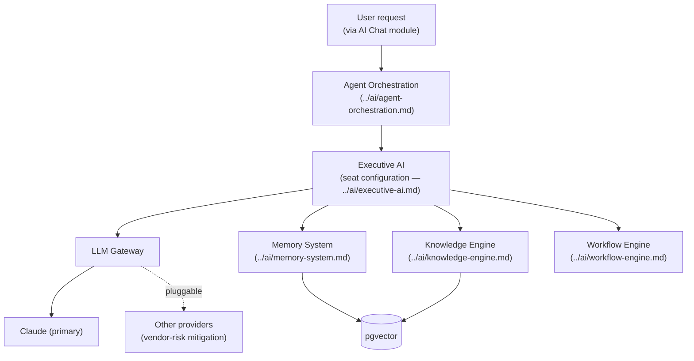

# AI Platform

## Why "AI-First" Means an Architectural Layer, Not a Feature

Every other document in `platform/` treats the AI Workforce as a first-class system component (see [`../architecture/system-architecture.md`](../architecture/system-architecture.md)) with its own gateway, memory, and orchestration — not a chat widget bolted onto a conventional CRUD app. This document defines that layer.

## The Four AI Subsystems

## LLM Gateway

**Decision: an internal abstraction service between the AI Workforce and any model provider — never a direct provider SDK call from business logic.**

Justification: this is the concrete mitigation for R-003 in [`executive-brain/risk-register.md`](../../executive-brain/risk-register.md) (AI agents acting under `CLAUDE.md` taking action beyond delegated authority, and the related vendor-concentration exposure). The Gateway:

- Routes requests to Claude by default (see [`../architecture/technology-stack.md`](../architecture/technology-stack.md) for why Claude), with configuration-only failover to an alternate provider if Claude is unavailable (see [`../architecture/disaster-recovery.md`](../architecture/disaster-recovery.md)).
- Enforces per-seat, per-tenant rate limits and cost caps (see [`../architecture/scalability.md`](../architecture/scalability.md)) — no seat can run away with unbounded API spend.
- Logs every prompt and response, with Restricted-classification content (per [`../database/data-governance.md`](../database/data-governance.md)) redacted before it ever leaves the platform's boundary — a hard technical control, not a prompting convention asking the model to "please not share sensitive data."
- Streams tokens back to the client for the responsive chat experience already demonstrated in the [prototype](../../projects/bhubesi-os/README.md).

## Cost and Usage Metering

Every LLM Gateway call is attributed to a `company_id` and `seat_id` (see [`../database/entity-relationship-diagram.md`](../database/entity-relationship-diagram.md)), rolling up into the financial KPIs in [`executive-brain/kpi-framework.md`](../../executive-brain/kpi-framework.md) — AI cost is a visible, attributable line item per venture, not an opaque platform-wide bill the CFO can't decompose.

## Tool Use (Function Calling)

Seats don't just generate text — they call platform capabilities as tools (e.g., "look up this contact in CRM," "check this budget's remaining balance"). Every tool a seat can call is explicitly scoped to that seat's actual authority (see [`executive-ai.md`](./executive-ai.md) and [`../api/authorization.md`](../api/authorization.md)) — the Gateway enforces this at the tool-registration layer, so a prompt-injection attempt asking a seat to "ignore your restrictions" cannot actually grant access to a tool the seat was never registered to call.

## Relationship to the Existing Prototype

The [Bhubesi OS AI Chat Interface prototype](../../projects/bhubesi-os/README.md) currently *simulates* seat responses client-side with no real backend. This platform design replaces `responder.ts`'s simulated logic with real calls through the LLM Gateway described here — see [`../roadmap/mvp.md`](../roadmap/mvp.md) for the specific migration step, which is deliberately the first thing built after this architecture is approved.

## Model Provider Risk Management

Reviewed against [`executive-brain/risk-register.md`](../../executive-brain/risk-register.md) R-003 at minimum quarterly: Is Claude still the right default? Has usage grown enough to justify negotiating enterprise terms? Is there a case for a second, always-warm provider rather than cold failover? These are standing questions for the [CTO seat](../../ai-agents/workforce/cto.md), not one-time decisions.
