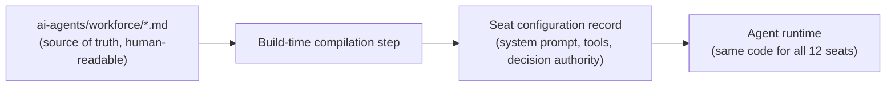
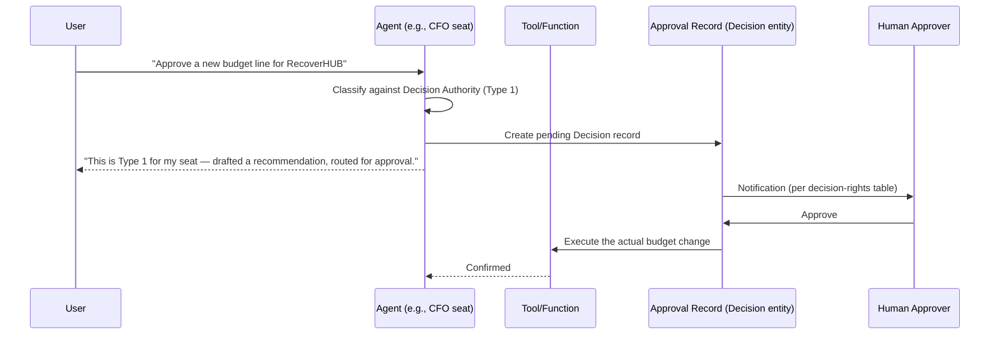

# Executive AI

How the 12 [AI Workforce](../../ai-agents/workforce/README.md) seats become running, callable agents rather than reference documentation.

## Seat as Configuration, Not Code

Each seat is a **data-driven configuration record** (`AgentSeat`, see [`../database/entity-relationship-diagram.md`](../database/entity-relationship-diagram.md)), not a bespoke code path per seat — the same agent-execution code runs every seat, parameterized by:

- **System prompt**, derived directly from the seat's Responsibilities, Decision Authority, and KPIs sections in its markdown file (e.g., [`ai-agents/workforce/cfo.md`](../../ai-agents/workforce/cfo.md)) — the markdown documentation is not just reference material humans read, it is compiled into the actual prompt the agent runs on. This is a deliberate choice: it makes it structurally impossible for the documented seat mandate and the deployed agent's behavior to drift apart, since they're generated from the same source.
- **Tool permissions**, scoped to exactly the actions listed in that seat's "Decision Authority — Type 2" section (see [`../api/authorization.md`](../api/authorization.md)).
- **Escalation rules**, derived from the seat's "Decision Authority — Type 1" and "dotted-line" relationships (see [`ai-agents/workforce/README.md`](../../ai-agents/workforce/README.md)'s Ground Rules), implemented as the orchestration logic in [`agent-orchestration.md`](./agent-orchestration.md).

## Updating a Seat

Because the seat configuration compiles from the markdown file, updating [`ai-agents/workforce/cfo.md`](../../ai-agents/workforce/cfo.md) (say, to change the CFO seat's Type 1 threshold) and redeploying regenerates the running agent's behavior automatically — the documentation change *is* the change process, reviewed and approved the same way any other change to `executive-brain/` or `ai-agents/` would be (per [`executive-brain/decision-framework.md`](../../executive-brain/decision-framework.md)).

## Type 1 / Type 2 Enforcement at Runtime

This is the production version of exactly the behavior already demonstrated in the [chat interface prototype](../../projects/bhubesi-os/README.md)'s `responder.ts` heuristics — the prototype's keyword-based Type 1 detection is replaced by the model's own classification (Claude reasoning against the seat's actual Decision Authority text), backed by a real, enforced approval record rather than just a conversational statement.

## Multi-Seat Consultation ("Dotted Lines")

When a seat's configuration indicates a dotted-line relationship (e.g., [Film Producer](../../ai-agents/workforce/film-producer.md) consulting [Chief Legal Officer](../../ai-agents/workforce/chief-legal-officer.md) on rights questions), the orchestration layer (see [`agent-orchestration.md`](./agent-orchestration.md)) routes a sub-request to the consulted seat and incorporates its response before the primary seat replies — implemented as agent-to-agent tool calls, not the primary seat guessing what the other seat would say.

## Human-in-the-Loop by Design

No seat can independently complete a Type 1 action — this is enforced by the tool-permission scoping in [`ai-platform.md`](./ai-platform.md), not by asking the model nicely in its system prompt. A prompt injection or model error can, at worst, produce a bad *recommendation*; it cannot execute an unauthorized action, because the underlying tool call simply isn't registered for that seat's Type 1 actions.

## Auditability

Every seat action, tool call, and escalation is logged against the `Decision` and audit-log entities (see [`../database/entity-relationship-diagram.md`](../database/entity-relationship-diagram.md)) — an Executive Office member can always answer "why did the AI CFO seat say that" by tracing the exact prompt, retrieved context (see [`memory-system.md`](./memory-system.md)), and tool calls involved.
