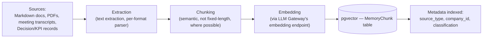

# Knowledge Engine

The ingestion and retrieval pipeline behind the Knowledge Search module (see [`../../projects/bhubesi-os/README.md`](../../projects/bhubesi-os/README.md)) and Tier 3 memory (see [`memory-system.md`](./memory-system.md)).

## Ingestion Pipeline

## Retrieval Strategy

**Decision: hybrid retrieval — vector similarity plus keyword/full-text search, not vector-only.**

Justification: pure vector similarity search occasionally misses exact-match needs (a seat asked "what does the R-002 risk entry say" should reliably find that specific document by its identifier, not just something semantically similar to it). Hybrid retrieval combines `pgvector` cosine similarity with Postgres full-text search (per [`../architecture/technology-stack.md`](../architecture/technology-stack.md)'s search decision) and merges results — good recall for both "find something like this" and "find exactly this" queries.

## Source Attribution

Every answer a seat gives that draws on retrieved knowledge cites its source (document name, section, or record ID) — implemented by carrying source metadata through retrieval into the prompt, and instructing the model to attribute claims to sources rather than presenting retrieved content as its own general knowledge. This is a trust and auditability requirement, not a nice-to-have: an Executive Office member should be able to verify any AI-sourced claim by checking the cited document.

## Re-Indexing Triggers

| Trigger | Action |
|---|---|
| Merge to this repository's main branch | Re-ingest changed markdown files |
| New `Decision` record created | Ingest immediately (near-real-time — a just-made decision should be retrievable right away, not after a batch job) |
| New `KPI_SNAPSHOT` or `FinancialReport` | Ingest on the existing monthly/quarterly reporting cadence (see [`docs/governance.md`](../../docs/governance.md)) |
| Meeting transcript ingested (see [`../api/integrations.md`](../api/integrations.md)) | Ingest on receipt |

## Access-Aware Retrieval

Retrieval always runs within the requesting user/seat's authorization context (see [`../api/authorization.md`](../api/authorization.md)) — the Knowledge Engine's index is a single physical store, but query results are always filtered by the same `company_id` and classification rules as every other data access in the platform (see [`../database/storage-strategy.md`](../database/storage-strategy.md)). There is no "search everything" mode that bypasses tenant or classification boundaries.

## Document Formats Supported

Markdown (this repository's native format), PDF (contracts, external reports), and plain text (meeting transcripts) at MVP; expand to structured formats (spreadsheets for financial data) as [`../roadmap/version-2.md`](../roadmap/version-2.md)'s Finance module matures and generates more of its own source material to index.

## Ownership

[Chief Research Officer](../../ai-agents/workforce/chief-research-officer.md) owns what gets classified as authoritative knowledge (consistent with the seat's existing mandate to provide "evidence base" per [`ai-agents/workforce/chief-research-officer.md`](../../ai-agents/workforce/chief-research-officer.md)); [CTO](../../ai-agents/workforce/cto.md) owns the pipeline's technical operation.
