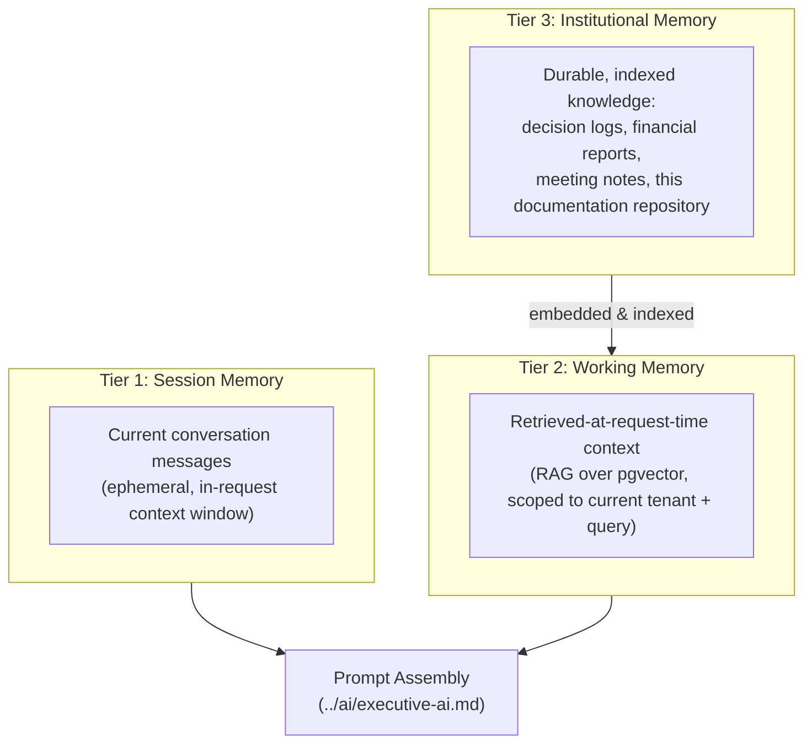

# Memory System

## Three Tiers

## Tier 1 — Session Memory

The current conversation's messages, held in the request context exactly as the [chat interface prototype](../../projects/bhubesi-os/README.md) already does with its in-memory `history` state — the production version persists this to the `Conversation`/`Message` tables (see [`../database/entity-relationship-diagram.md`](../database/entity-relationship-diagram.md)) so a conversation survives a page refresh or app restart, unlike the current prototype.

## Tier 2 — Working Memory (Retrieval-Augmented Generation)

At request time, relevant context is retrieved via vector similarity search over `pgvector` (see [`../database/storage-strategy.md`](../database/storage-strategy.md)), scoped to:

- The current tenant (`company_id`) — a RecoverHUB conversation never retrieves 360Sports context, per the same RLS boundary as everything else (see [`../database/data-model.md`](../database/data-model.md)).
- The requesting seat's authorization level — retrieval respects [`../api/authorization.md`](../api/authorization.md)'s classification rules, so a seat without Restricted-data access cannot retrieve it via RAG even if it's semantically the best match for the query (see [`../database/storage-strategy.md`](../database/storage-strategy.md)'s note on this).

## Tier 3 — Institutional Memory

The durable knowledge base every seat draws from, populated from:

| Source | Ingested By |
|---|---|
| This documentation repository (`executive-brain/`, `ai-agents/`, business unit and venture docs) | [Knowledge Engine](./knowledge-engine.md) ingestion pipeline |
| `Decision` records (logged Type 1/Type 2 decisions) | Automatic, on creation |
| `KPI_SNAPSHOT` and `FinancialReport` records | Automatic, on each reporting cycle |
| Meeting notes (via Google/Zoom integration, see [`../api/integrations.md`](../api/integrations.md)) | Ingestion pipeline, once that integration is built |

This is the literal technical realization of `executive-brain/`'s existing role: the markdown doctrine this company has already written becomes the seed corpus for the platform's own institutional memory — a new AI Workforce deployment isn't starting from a blank slate, it inherits everything already documented in this repository as of the day it's ingested.

## Memory Freshness

Institutional memory is re-indexed on every merge to this repository's main branch (documentation changes) and incrementally as new `Decision`/`KPI_SNAPSHOT` records are created (operational data) — see [`knowledge-engine.md`](./knowledge-engine.md) for the pipeline. Stale memory (an agent citing an outdated policy) is treated as a bug, not an acceptable limitation.

## Per-Venture vs. Company-Wide Memory

Institutional memory follows the same tenant hierarchy as everything else (see [`../database/data-model.md`](../database/data-model.md)): venture-specific documents (e.g., [RecoverHUB's SOPs](../../projects/recoverhub/sops.md)) are scoped to that tenant's memory; company-wide doctrine (`executive-brain/`) is visible to every tenant, since it governs all of them per [`executive-brain/README.md`](../../executive-brain/README.md)'s precedence rule.

## Memory Retention and Deletion

Governed by [`../database/data-governance.md`](../database/data-governance.md) — a data-subject deletion request against a source record (e.g., a RecoverHUB participant's data) must also remove any derived `MemoryChunk` embeddings, not just the source row. This is tracked as an explicit cascade in the deletion workflow, not an afterthought.
