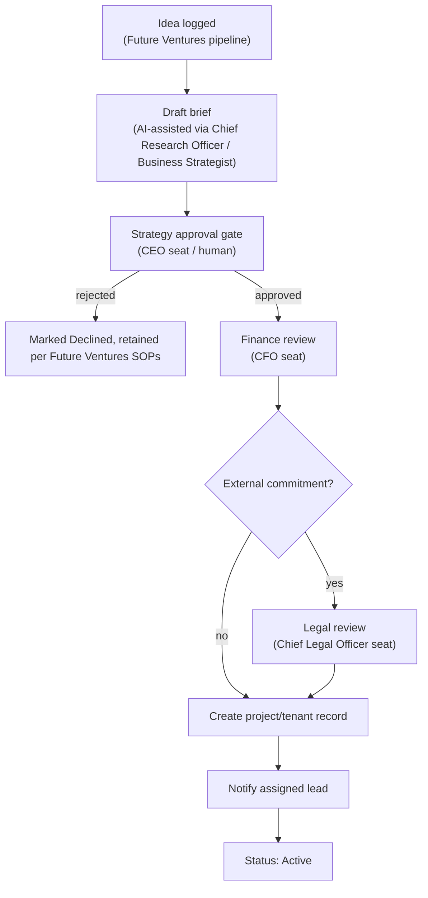

# Workflow Engine

The executable version of [`workflows/`](../../workflows) — turning documented procedures into trackable, durable, resumable software state, powering the Automation Hub module (see [`../../projects/bhubesi-os/README.md`](../../projects/bhubesi-os/README.md)).

## Decision: Temporal (Durable Execution)

| Option | Verdict | Why |
|---|---|---|
| Temporal | **Chosen** | Purpose-built for exactly this problem: long-running, multi-step processes that span days (a Type 1 approval can sit pending for a while), survive process restarts, and mix automated steps (an AI seat drafting a recommendation) with human-in-the-loop steps (a human approving it) — see [`../ai/executive-ai.md`](../ai/executive-ai.md)'s approval flow. |
| Custom state-machine tables + cron jobs | Rejected | Workable at small scale but reinvents (poorly) what Temporal already solves: crash recovery, retries, and visibility into where a given workflow instance currently is. Not a good use of a lean team's time. |
| A generic workflow-automation SaaS (e.g., Zapier-style) | Rejected as the core engine | Fine for simple integration glue (see [`../api/integrations.md`](../api/integrations.md)), but not expressive enough for the branching, multi-approver logic in [`executive-brain/decision-framework.md`](../../executive-brain/decision-framework.md) and [`workflows/project-kickoff.md`](../../workflows/project-kickoff.md). |

## Workflows Modeled

| Documented Workflow | Executable As |
|---|---|
| [`workflows/standard-workflow.md`](../../workflows/standard-workflow.md) | A lightweight tracked task, not necessarily a full Temporal workflow — this one is intentionally kept simple, since forcing every task through heavy workflow infrastructure would be its own kind of over-engineering |
| [`workflows/decision-making.md`](../../workflows/decision-making.md) / [`executive-brain/decision-framework.md`](../../executive-brain/decision-framework.md) | A Temporal workflow: frame → classify → gather input → recommend → approve (if Type 1) → log → communicate |
| [`workflows/project-kickoff.md`](../../workflows/project-kickoff.md) | A Temporal workflow with explicit approval gates (Strategy, Finance, Legal) matching [`docs/governance.md`](../../docs/governance.md)'s decision-rights table |
| [`executive-brain/quarterly-planning-framework.md`](../../executive-brain/quarterly-planning-framework.md) | A recurring (cron-scheduled) Temporal workflow orchestrating the draft → align → commit → execute → review cycle across every tenant |

## Example: Project Kickoff as a Workflow

Each box with a named seat is an actual `AgentSeat`-initiated or human-approved step, tracked as Temporal "activities" — the workflow durably remembers where it is even if no one touches it for days while waiting on a human approval, which is the realistic timeline for a Finance or Legal review.

## Human-in-the-Loop Steps

Temporal's "signal" mechanism represents a human approval or input — a workflow pauses at a gate and resumes only when the relevant seat's approval is recorded (see [`../ai/executive-ai.md`](../ai/executive-ai.md)'s approval-record pattern), which is both the correctness mechanism and the audit trail.

## Observability

Every running and completed workflow instance is visible in Temporal's UI and surfaced in the Automation Hub module's status view — an Executive Office member can see exactly which project briefs are stuck waiting on which approver, addressing a real, current pain point (workflows that exist only as informal expectation today have no visibility if they stall).

## Ownership

[CTO seat](../../ai-agents/workforce/cto.md) owns the workflow engine's technical operation; each workflow definition's business logic is owned by whichever seat owns the underlying documented process (e.g., [COO](../../ai-agents/workforce/coo.md) for quarterly planning, per [`ai-agents/workforce/coo.md`](../../ai-agents/workforce/coo.md)).
