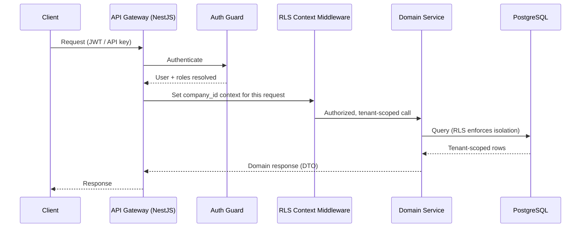

# API Architecture

## Dual API Strategy

**Decision: tRPC for internal clients (web, mobile), a versioned REST API for external integrations and partners.**

| Consumer | Protocol | Why |
|---|---|---|
| Web app, mobile app (same monorepo) | tRPC | End-to-end TypeScript type safety with no code generation step — the client gets compile-time errors if it calls an API shape that no longer exists. Fast iteration, appropriate because client and server ship from the same monorepo and deploy together (see [`../architecture/solution-architecture.md`](../architecture/solution-architecture.md)). |
| External partners (future government/NGO integrations, a future public API) | REST, versioned | Universally consumable by any external system regardless of language — a partner's system shouldn't need to adopt tRPC to integrate with Bhubesi OS. See [`versioning.md`](./versioning.md). |

This is not duplication for its own sake: the REST layer and tRPC layer call into the *same* domain services (see [`../architecture/solution-architecture.md`](../architecture/solution-architecture.md)'s layering) — the protocol is a presentation-layer choice, not a second implementation of business logic.

## Request Lifecycle

The RLS context middleware sets a Postgres session variable (`app.current_company_id`) per request, which every RLS policy references — see [`../database/data-model.md`](../database/data-model.md). This means tenant isolation is enforced even if a service-layer bug forgets to filter by tenant explicitly.

## API Design Principles

1. **Every endpoint is tenant-scoped by default.** Cross-tenant access (Executive Office visibility) is an explicit, separately-authorized capability, not the default query shape with a missing filter.
2. **Every mutation that maps to a Type 1 decision requires an approval step**, not just an authorization check — see [`authorization.md`](./authorization.md) and [`../ai/executive-ai.md`](../ai/executive-ai.md).
3. **Idempotency keys** on all mutating endpoints, given mobile clients on unreliable connections (see [`../mobile/offline-strategy.md`](../mobile/offline-strategy.md)) will retry requests.
4. **Errors are structured and typed**, not free-text strings — both REST and tRPC responses use a shared error shape (`{ code, message, details }`) so clients can handle failures programmatically (e.g., distinguish "validation error" from "authorization denied" from "Type 1 approval pending").

## Rate Limiting and Abuse Protection

Per-user and per-tenant rate limits enforced at the Gateway layer (Redis-backed token bucket), with separately-configured, tighter limits on AI Gateway-backed endpoints given their cost profile (see [`../ai/ai-platform.md`](../ai/ai-platform.md)).

## External Partner API (Future)

Scoped for [`../roadmap/version-3.md`](../roadmap/version-3.md): API keys issued per partner organization, scoped to specific resources (e.g., a government department integration might only ever call RecoverHUB referral endpoints, never Finance). Not built at MVP — documented here so the REST layer's versioning discipline (see [`versioning.md`](./versioning.md)) is in place before external consumers exist, rather than retrofitted after a partner is already depending on an unversioned endpoint.
