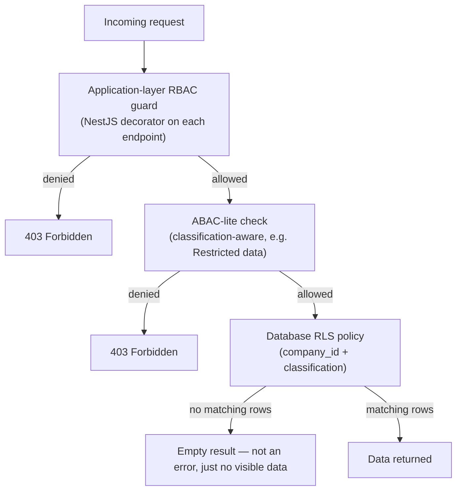

# Authorization

## Two-Layer Model: RBAC + ABAC-Lite

**Layer 1 — RBAC**, mapped directly onto the [AI Workforce](../../ai-agents/workforce/README.md) org chart, so the same role model governs both human staff and AI seats — there is no separate, parallel permission system for AI actions.

**Layer 2 — ABAC-lite**, adding attribute-based rules on top of RBAC for specific sensitive-data cases (RecoverHUB participant records) where role alone is too coarse.

## RBAC: Roles

| Role | Maps To | Typical Access |
|---|---|---|
| `ceo` | [CEO seat](../../ai-agents/workforce/ceo.md) | Cross-tenant read; company-wide strategic data |
| `coo` | [COO seat](../../ai-agents/workforce/coo.md) | Cross-tenant read; project/operations data |
| `cfo` | [CFO seat](../../ai-agents/workforce/cfo.md) | Cross-tenant read on Finance module; write within approved budgets |
| `cto` | [CTO seat](../../ai-agents/workforce/cto.md) | Platform admin; technical configuration |
| `clo` | [Chief Legal Officer seat](../../ai-agents/workforce/chief-legal-officer.md) | Cross-tenant read on Documents/contracts; Restricted-classification gate approval |
| `venture_lead` | A named human lead for a specific tenant (e.g., RecoverHUB) | Full read/write within that tenant only |
| `venture_staff` | Operational staff within a tenant | Scoped read/write per module, per [`../database/data-model.md`](../database/data-model.md) |
| `partner` | External partner (future) | Narrow, explicitly-granted read access to specific shared resources only |

This table is not exhaustive of all 12 AI Workforce seats — every seat in [`ai-agents/workforce/`](../../ai-agents/workforce/README.md) has a corresponding role; the table above shows the pattern, not the full enumeration (maintained in code as the single source of truth to avoid the documentation and implementation drifting apart).

## Enforcement: Defense in Depth

The application-layer check and the database-layer RLS policy are **independently implemented** — a bug in one is caught by the other. This redundancy is deliberate, not an oversight to clean up later.

## ABAC-Lite: Sensitive Data Rules

For Restricted-classification data (see [`../database/data-governance.md`](../database/data-governance.md)), access requires *both* an appropriate role *and* an explicit grant tied to that specific record or record category — e.g., a `venture_staff` role at RecoverHUB does not automatically see every participant's full record; only staff explicitly assigned to that participant's cohort do, per [`../../projects/recoverhub/sops.md`](../../projects/recoverhub/sops.md)'s safeguarding requirements.

## Type 1 / Type 2 Enforcement

Authorization also encodes [`executive-brain/decision-framework.md`](../../executive-brain/decision-framework.md)'s decision classification:

- A **Type 2** action (e.g., CFO approving spend within an existing budget) executes immediately once RBAC/ABAC checks pass.
- A **Type 1** action (e.g., a new budget line) is *authorized to propose* but requires a separate approval record before it takes effect — modeled as a `Decision` entity in `pending` state (see [`../database/entity-relationship-diagram.md`](../database/entity-relationship-diagram.md)) until the designated approver (per [`docs/governance.md`](../../docs/governance.md)'s decision-rights table) confirms it.

This is what makes the AI Workforce's decision authority (documented per-seat in [`ai-agents/workforce/`](../../ai-agents/workforce/README.md)) an enforced technical constraint rather than a convention an agent could ignore — see [`../ai/executive-ai.md`](../ai/executive-ai.md).

## Cross-Tenant Access (Executive Office)

Executive Office roles (`ceo`, `coo`, `cfo`, etc.) have RLS policies granting read access across all child companies of the holding company (see [`../database/data-model.md`](../database/data-model.md)'s tenant hierarchy) — this is an explicit, narrow exception in the RLS policy set, not a general bypass, and is itself audit-logged per [`../architecture/security-architecture.md`](../architecture/security-architecture.md).

## Review

Role definitions reviewed whenever the [AI Workforce org chart](../../ai-agents/workforce/README.md) changes (see its "Adding a Seat" process) — authorization code and the workforce documentation are treated as a single system that must stay in sync.
