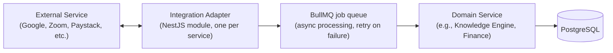

# Integrations

## Principle

Integrate with what the company already uses before building anything speculative. The company's active tooling already signals clear first targets — Google Workspace and Zoom appear to be in current use, and a domain (`bhubesi.co.za`, with `os.bhubesi.co.za` reserved for this platform) is registered via GoDaddy. These are inferred from observed tooling, not confirmed contractual relationships — [Chief Operating Officer](../../ai-agents/workforce/coo.md) should confirm before integration work begins.

## Priority Integrations

| Integration | Purpose | Priority |
|---|---|---|
| Google Workspace (Calendar, Gmail) | Meeting scheduling visibility, ingesting meeting notes into the Knowledge Engine (see [`../ai/knowledge-engine.md`](../ai/knowledge-engine.md)) | High — MVP-adjacent |
| Zoom | Ingesting meeting recordings/transcripts as a knowledge source | Medium — [`../roadmap/version-1.md`](../roadmap/version-1.md) |
| Paystack / Flutterwave | African-market payment processing for future revenue lines (RecoverHUB premium coaching, 360Sports subscriptions — see their respective `financial-model.md` documents) | Medium — tied to whichever venture activates a paid revenue line first |
| Stripe | International/USD-denominated payments (e.g., The Chairman's international distribution revenue, educational licensing) | Medium — same trigger as above |
| GoDaddy (DNS) | Domain management for `bhubesi.co.za` and subdomains | Low — one-time setup, see [`../architecture/deployment-architecture.md`](../architecture/deployment-architecture.md) |

## Integration Architecture Pattern

Every integration is an isolated adapter module (per [`../architecture/solution-architecture.md`](../architecture/solution-architecture.md)'s module-boundary principle) — a Zoom outage or API change never breaks Finance or CRM, and vice versa. Integration calls run through the async job queue (BullMQ, per [`../architecture/technology-stack.md`](../architecture/technology-stack.md)) rather than blocking a user-facing request on a third-party API's latency.

## Webhook Handling

Inbound webhooks (e.g., Paystack payment confirmation, Zoom recording-ready notification) are verified by signature before processing, logged, and processed idempotently (safe to receive the same webhook twice) — consistent with [`api-architecture.md`](./api-architecture.md)'s idempotency principle.

## Data Governance for Integrations

Any integration that touches Confidential or Restricted-classification data (see [`../database/data-governance.md`](../database/data-governance.md)) — for instance, a future integration with a government referral system for RecoverHUB — requires a data-sharing agreement cleared by [Chief Legal Officer](../../ai-agents/workforce/chief-legal-officer.md) before the technical integration is built, per [`../../projects/recoverhub/sops.md`](../../projects/recoverhub/sops.md) Section 1.

## Future Partner API

External partners consuming Bhubesi OS data (rather than the reverse) are addressed in [`api-architecture.md`](./api-architecture.md)'s "External Partner API" section and scoped to [`../roadmap/version-3.md`](../roadmap/version-3.md) — not built until the platform has proven integrations working in the simpler, outbound direction first.
