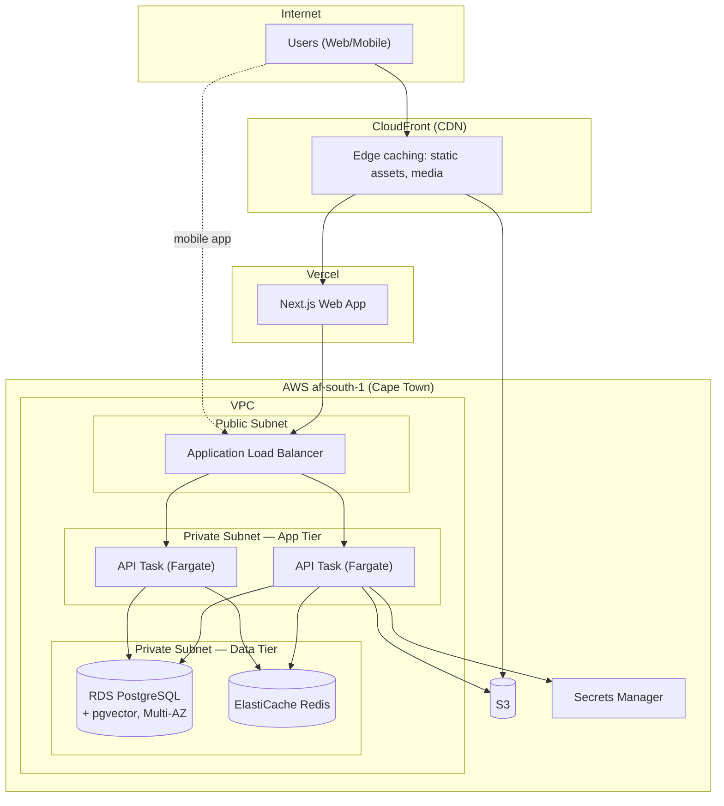

# Deployment Architecture

## Environments

| Environment | Purpose | Data |
|---|---|---|
| `dev` | Active development, ephemeral preview deployments per pull request | Synthetic/seeded data only |
| `staging` | Pre-production validation, mirrors `production` topology | Anonymized copy of production or synthetic data |
| `production` | Live system | Real data, full security controls from [`security-architecture.md`](./security-architecture.md) |

Environment parity matters specifically because [`../database/data-governance.md`](../database/data-governance.md) restricts real participant data (e.g., RecoverHUB) to `production` only — `staging` never holds real sensitive data.

## Domain Strategy

- **Production:** `os.bhubesi.co.za` (reserved; DNS not yet pointed at any infrastructure as of this writing).
- **Staging:** `staging.os.bhubesi.co.za`.
- **Preview (per PR):** ephemeral subdomains, e.g., `pr-123.preview.os.bhubesi.co.za`.

## Deployment Topology

Rationale for splitting Next.js (Vercel) from the API (AWS Fargate): Vercel's edge network gives the frontend the best possible SSR/static performance with zero ops overhead, while the API and data tier stay in `af-south-1` for data-residency and to keep latency low between the API and its database — see [`technology-stack.md`](./technology-stack.md).

## CI/CD Pipeline

```mermaid
flowchart LR
    PR["Pull Request opened"] --> CI["GitHub Actions: lint, type-check, test"]
    CI --> Preview["Deploy preview\n(Vercel preview + ephemeral API)"]
    Preview --> Review["Code review + CTO seat sign-off\nfor architecture-affecting changes"]
    Review --> Merge["Merge to main"]
    Merge --> StagingDeploy["Auto-deploy to staging"]
    StagingDeploy --> Smoke["Smoke tests"]
    Smoke --> ProdApproval["Manual approval gate\n(Type 1 per decision-framework.md)"]
    ProdApproval --> ProdDeploy["Deploy to production"]
    ProdDeploy --> Monitor["Post-deploy monitoring window"]
```

Production deployment is a deliberate manual gate, not full continuous deployment — consistent with treating infrastructure changes as Type 1 decisions per [`executive-brain/decision-framework.md`](../../executive-brain/decision-framework.md) until the team has enough deployment history to trust full automation.

## Rollback Strategy

Fargate task definitions are versioned; a failed production deployment rolls back to the previous task definition revision within minutes. Database migrations follow an expand-contract pattern (additive changes deployed ahead of code that depends on them) so a code rollback never requires a database rollback.

## Related

[`infrastructure.md`](./infrastructure.md) (provisioning detail), [`scalability.md`](./scalability.md) (scaling triggers), [`disaster-recovery.md`](./disaster-recovery.md) (failure recovery).
