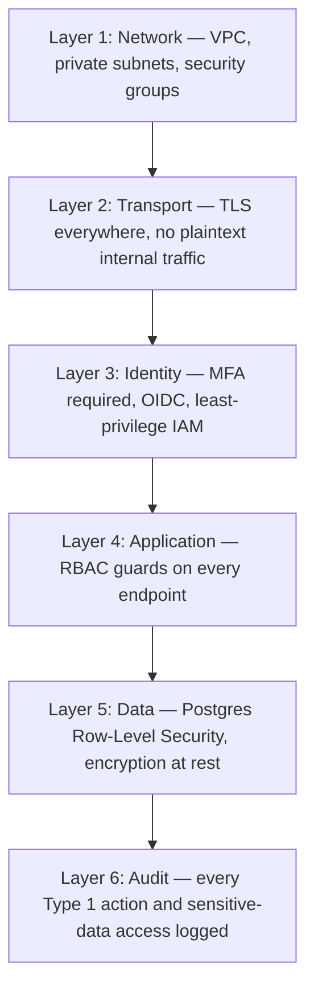

# Security Architecture

**Principle: Secure by default** — every decision below defaults to the safer option and requires deliberate action to loosen, never the reverse.

## Defense in Depth

No single layer is trusted alone — a bug in an application-layer authorization check (Layer 4) is still contained by database-layer RLS (Layer 5), which is itself still logged (Layer 6).

## Identity and Access

Detailed in [`../api/authentication.md`](../api/authentication.md) and [`../api/authorization.md`](../api/authorization.md). Summary of the security posture: MFA required for every Executive Office and admin account without exception; SSO preferred over password-only accounts wherever a partner organization supports it; session tokens short-lived with refresh rotation.

## Data Protection

- **Encryption at rest:** RDS and S3 native encryption (AWS KMS-managed keys).
- **Encryption in transit:** TLS 1.2+ enforced everywhere, including internal service-to-service traffic within the VPC.
- **Row-Level Security:** every tenant-scoped table enforces `company_id` isolation at the database layer — an application bug cannot leak one venture's data into another's view. See [`../database/data-model.md`](../database/data-model.md).
- **Sensitive data classification:** RecoverHUB participant data is classified Restricted per [`../database/data-governance.md`](../database/data-governance.md), with additional access controls beyond standard RBAC (see [`../api/authorization.md`](../api/authorization.md)'s ABAC-lite layer).

## Compliance Posture

- **POPIA (South Africa):** the primary near-term compliance target, given `af-south-1` hosting and a South African legal entity. Data-subject access and deletion requests are a first-class capability, not an afterthought — see [`../database/data-governance.md`](../database/data-governance.md).
- **Cross-border data considerations:** as ventures expand into other African markets, each jurisdiction's data protection regime (e.g., Kenya's DPA, Nigeria's NDPR) is evaluated case by case rather than assumed equivalent to POPIA — flagged as a standing item for [Chief Legal Officer](../../ai-agents/workforce/chief-legal-officer.md) as expansion occurs.
- **SOC 2 readiness:** not pursued as a certification at MVP stage, but every control in this document is chosen so that certification is a paperwork and audit exercise later, not an architecture rewrite — an explicit design-for-optionality choice given the enterprise/institutional partners (government, corporates) this platform expects to serve.

## AI-Specific Security

- Every LLM Gateway call is logged with the seat, prompt, and response (redacted for Restricted-classification data) — see [`../ai/ai-platform.md`](../ai/ai-platform.md).
- AI agents never receive direct database credentials — all data access happens through the same authorized service layer a human user would use, meaning RLS and RBAC apply identically to AI-initiated actions.
- Tool-use actions available to an AI seat are scoped to that seat's actual Decision Authority (Type 2 actions only execute directly; Type 1 actions require human approval) — enforced in code, not just in the seat's system prompt. See [`../ai/executive-ai.md`](../ai/executive-ai.md).

## Secrets Management

All credentials (database passwords, LLM API keys, payment gateway keys) live in AWS Secrets Manager, injected into Fargate tasks at runtime — never committed to the repository, never in plaintext environment files. Rotation policy: automatic rotation for database credentials; manual rotation on a quarterly cadence for third-party API keys, tracked against [`executive-brain/quarterly-planning-framework.md`](../../executive-brain/quarterly-planning-framework.md).

## Dependency and Vulnerability Management

GitHub Dependabot enabled on the monorepo; security-severity dependency updates treated as an expedited (non-quarterly) merge. Container images scanned in CI before deployment.

## Incident Response

Any security incident is a Type 1 event by definition — immediate escalation to [Chief Legal Officer](../../ai-agents/workforce/chief-legal-officer.md) and [CTO](../../ai-agents/workforce/cto.md), logged per [`templates/decision-log-template.md`](../../templates/decision-log-template.md), and tracked as a new or updated entry in [`executive-brain/risk-register.md`](../../executive-brain/risk-register.md). A written incident response runbook is a prerequisite for [`../roadmap/mvp.md`](../roadmap/mvp.md) launch, not a post-launch nice-to-have.

## Security Review Cadence

Security posture reviewed at minimum quarterly (aligned to [`docs/governance.md`](../../docs/governance.md)'s Governance & Legal review cadence), and on every architecturally significant change per [`deployment-architecture.md`](./deployment-architecture.md)'s CI/CD approval gate.
