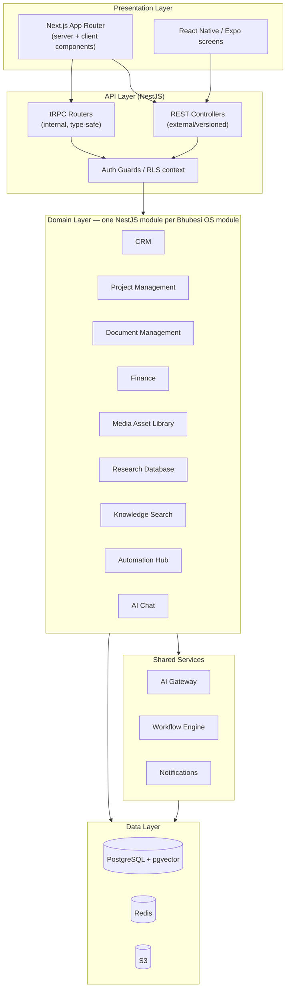
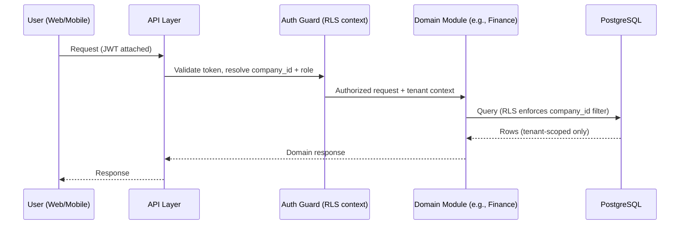

# Solution Architecture

How [`system-architecture.md`](./system-architecture.md)'s components are internally structured — the module boundaries, layering, and monorepo organization that make "modular architecture" real rather than aspirational.

## Layered Architecture



## Module Boundaries

Each Bhubesi OS module (per [`projects/bhubesi-os/README.md`](../../projects/bhubesi-os/README.md)) is a NestJS module with its own:

- Postgres schema/table namespace (e.g., `crm.*`, `finance.*`) — logical separation even within one database.
- Service and controller layer — no module reaches directly into another module's tables; cross-module data access goes through the other module's service interface.
- Ownership mapped to an AI Workforce seat (see table below), consistent with [`docs/governance.md`](../../docs/governance.md)'s decision-rights model.

| Module | Primary Owning Seat | Status |
|---|---|---|
| AI Chat | [CTO](../../ai-agents/workforce/cto.md) (platform), all seats (content) | Built — [prototype live](../../projects/bhubesi-os/README.md) |
| CRM | [Sales Director](../../ai-agents/workforce/sales-director.md), [Chief Marketing Officer](../../ai-agents/workforce/chief-marketing-officer.md) | Planned — [`../roadmap/version-1.md`](../roadmap/version-1.md) |
| Project Management | [COO](../../ai-agents/workforce/coo.md) | Planned — [`../roadmap/version-1.md`](../roadmap/version-1.md) |
| Document Management | [COO](../../ai-agents/workforce/coo.md), [Chief Legal Officer](../../ai-agents/workforce/chief-legal-officer.md) | Planned — [`../roadmap/mvp.md`](../roadmap/mvp.md) |
| Finance | [CFO](../../ai-agents/workforce/cfo.md) | Planned — [`../roadmap/version-2.md`](../roadmap/version-2.md) |
| Media Asset Library | [Chief Creative Officer](../../ai-agents/workforce/chief-creative-officer.md), [Film Producer](../../ai-agents/workforce/film-producer.md) | Planned — [`../roadmap/version-2.md`](../roadmap/version-2.md) |
| Research Database | [Chief Research Officer](../../ai-agents/workforce/chief-research-officer.md) | Planned — [`../roadmap/version-3.md`](../roadmap/version-3.md) |
| Knowledge Search | [CTO](../../ai-agents/workforce/cto.md) | Planned — [`../roadmap/mvp.md`](../roadmap/mvp.md) (basic) |
| Automation Hub | [CTO](../../ai-agents/workforce/cto.md) | Planned — [`../roadmap/version-2.md`](../roadmap/version-2.md) |

## Why a Modular Monolith, Structurally

The module boundary above is a **deployment-independent seam**: today, every module runs inside one NestJS process (see [`technology-stack.md`](./technology-stack.md) for why). If Media Asset Library's transcoding load, say, eventually needs independent scaling, it can be extracted into its own service *because* it already only talks to other modules through defined interfaces — no module directly queries another module's tables. This is the concrete mechanism behind "Modular architecture" as a principle, not just a folder-naming convention.

## Monorepo Layout

```
bhubesi-os/
├── apps/
│   ├── web/          # Next.js
│   ├── mobile/        # Expo / React Native
│   └── api/           # NestJS
├── packages/
│   ├── ui/             # Shared component library (see ../frontend/design-system.md)
│   ├── types/          # Shared TypeScript types (API contracts, entities)
│   ├── api-client/      # Typed tRPC/REST client used by web + mobile
│   ├── ai-client/       # AI Gateway client (see ../ai/ai-platform.md)
│   └── config/          # Shared ESLint/TS config
└── infra/               # Terraform (see infrastructure.md)
```

This extends, rather than replaces, [`projects/bhubesi-os/app`](../../projects/bhubesi-os/README.md) — the existing prototype becomes `apps/web` when the monorepo is introduced (see [`../roadmap/mvp.md`](../roadmap/mvp.md) for the migration step).

## Request Flow (Illustrative)



See [`../api/api-architecture.md`](../api/api-architecture.md) for the full API design and [`../api/authorization.md`](../api/authorization.md) for how the Guard resolves role and tenant context.
