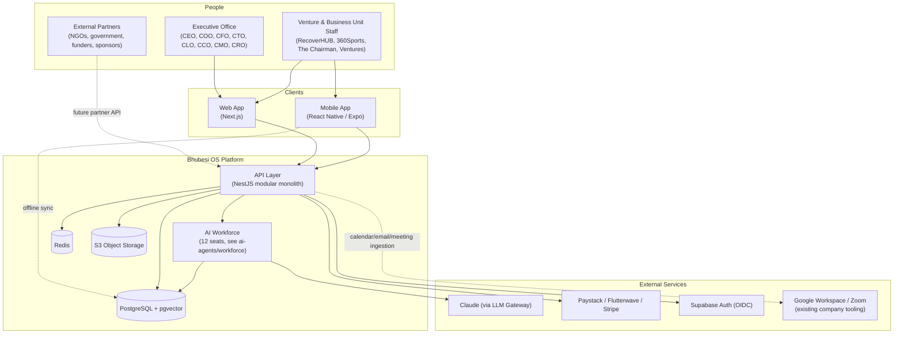

# System Architecture

**Owner:** [CTO seat](../../ai-agents/workforce/cto.md). Companion to [`technology-stack.md`](./technology-stack.md) (the *what and why* of each technology) — this document is the *shape* of the system.

## Principles Applied

Every structural decision below traces back to a stated principle:

| Principle | How It Shows Up Here |
|---|---|
| AI-first | The AI Workforce (see [`../ai/`](../ai)) is a first-class system component, not a bolt-on chat widget — it has its own gateway, memory, and orchestration layers. |
| Mobile-first | The mobile app (see [`../mobile/mobile-architecture.md`](../mobile/mobile-architecture.md)) is a peer client of the web app against the same API, not an afterthought web-view wrapper. |
| Cloud-native | Stateless, containerized services; managed data stores; horizontal scaling — see [`deployment-architecture.md`](./deployment-architecture.md). |
| Multi-company capable | Every tenant-scoped table carries a `company_id`; the Executive Office role can see across tenants, ventures cannot see each other's data by default — see [`../database/data-model.md`](../database/data-model.md). |
| Modular architecture | One NestJS module per Bhubesi OS module, one frontend route-group per module — see [`solution-architecture.md`](./solution-architecture.md). |
| Secure by default | RLS at the database layer, least-privilege IAM, MFA by default — see [`security-architecture.md`](./security-architecture.md). |
| Offline capable | A local-first mobile data layer syncs opportunistically — see [`../mobile/offline-strategy.md`](../mobile/offline-strategy.md). |
| Enterprise-grade | Audit logging, RBAC, disaster recovery, observability — see [`disaster-recovery.md`](./disaster-recovery.md). |
| Built for Africa, global standards | `af-south-1` hosting, CDN-cached media, data-cost-conscious mobile design, POPIA-aligned governance — see [`security-architecture.md`](./security-architecture.md) and [`../database/data-governance.md`](../database/data-governance.md). |

## System Context

## Component Overview

| Component | Responsibility | Detail |
|---|---|---|
| Web App | Executive Office and venture staff's primary interface | [`../frontend/ui-architecture.md`](../frontend/ui-architecture.md) |
| Mobile App | Field-usable, offline-capable interface | [`../mobile/mobile-architecture.md`](../mobile/mobile-architecture.md) |
| API Layer | Business logic, one module per Bhubesi OS module | [`solution-architecture.md`](./solution-architecture.md) |
| AI Workforce | The 12 seats as running agents, memory, orchestration | [`../ai/ai-platform.md`](../ai/ai-platform.md) |
| PostgreSQL + pgvector | System of record + AI memory | [`../database/data-model.md`](../database/data-model.md) |
| Redis | Cache + background job queue | [`technology-stack.md`](./technology-stack.md) |
| S3 Object Storage | Media assets, documents | [`../database/storage-strategy.md`](../database/storage-strategy.md) |

## How This Maps to the Business

This is not a generic platform diagram — it is specifically shaped by [`executive-brain/bhubesi-international-profile.md`](../../executive-brain/bhubesi-international-profile.md)'s holding-company model:

- **Executive Office** gets cross-tenant visibility for the [Executive Dashboard](../../executive-brain/executive-dashboard-spec.md) and the AI Workforce seats it chairs.
- **Each business unit and venture** ([RecoverHUB](../../projects/recoverhub/README.md), [360Sports](../../projects/360sports/README.md), [The Chairman](../../projects/the-chairman/README.md), [Bhubesi Ventures](../../business-units/bhubesi-ventures/README.md)) is a tenant scoped to its own data, drawing on the same shared modules and shared AI Workforce rather than each building its own systems — the technical expression of the "shared services" model already documented for Bhubesi Ventures.
- **Future subsidiaries** ([Future Ventures](../../projects/future-ventures/README.md) pipeline: Bhubesi AI, Consulting, Studios, Academy, Capital, Foundation) onboard as new tenants without any architectural change — this is the entire point of the multi-tenant design in [`../database/data-model.md`](../database/data-model.md).

## What This Is Not (Yet)

This architecture deliberately does not include: a public-facing consumer product surface, a microservices deployment topology, or a fine-tuned/self-hosted LLM. Each is a plausible future evolution, addressed explicitly in [`../roadmap/`](../roadmap) rather than built prematurely.
