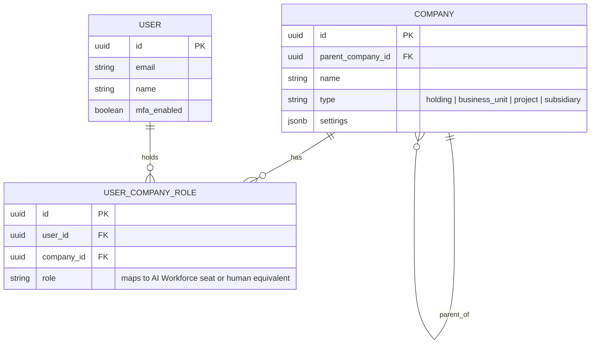

# Data Model

## Multi-Tenancy Model

**Decision: shared database, shared schema, row-level isolation via a `company_id` column and PostgreSQL Row-Level Security (RLS).**

| Option | Verdict | Why |
|---|---|---|
| Shared DB, RLS-enforced rows | **Chosen** | One database to operate, back up, and secure (see [`../architecture/technology-stack.md`](../architecture/technology-stack.md)); RLS enforces isolation at the layer closest to the data, not just in application code. Cheapest to run at Bhubesi's current scale (a handful of tenants), with a clear upgrade path. |
| Schema-per-tenant | Rejected for now | Cleaner isolation but multiplies migration and connection-pool overhead per tenant — unjustified until tenant count or per-tenant data sensitivity (see below) demands it. |
| Database-per-tenant | Rejected | Right model for, e.g., a fully independent future subsidiary with its own compliance regime, but far more operational overhead than warranted today. Revisit per-tenant if a specific subsidiary's regulatory requirements (data residency in a different country, say) demand full physical separation. |

## Tenant Hierarchy

`COMPANY` is self-referential: Bhubesi International (the holding company, per [`executive-brain/bhubesi-international-profile.md`](../../executive-brain/bhubesi-international-profile.md)) is the root; RecoverHUB, 360Sports, The Chairman, and Bhubesi Ventures are child companies; any [Future Ventures](../../projects/future-ventures/README.md) idea that graduates is inserted as a new child row — no schema change required, satisfying "Multi-company capable" directly.

## Core Entities

See [`entity-relationship-diagram.md`](./entity-relationship-diagram.md) for the full diagram. Grouped by the module that owns them (per [`../architecture/solution-architecture.md`](../architecture/solution-architecture.md)):

| Entity Group | Key Entities | Owning Module |
|---|---|---|
| Identity & Access | `Company`, `User`, `UserCompanyRole` | Platform core |
| CRM | `Contact`, `Deal`, `Partnership` | CRM |
| Projects | `Project`, `Milestone`, `Objective`, `KeyResult` | Project Management |
| Documents | `Document`, `DocumentVersion` | Document Management |
| Finance | `Budget`, `Transaction`, `FinancialReport` | Finance |
| Media | `Asset`, `AssetVersion`, `License` | Media Asset Library |
| Governance | `Decision`, `Risk`, `KPI` | Platform core (mirrors [`executive-brain/`](../../executive-brain)) |
| AI | `AgentSeat`, `Conversation`, `Message`, `MemoryChunk` | AI Chat / AI platform (see [`../ai/memory-system.md`](../ai/memory-system.md)) |

## Governance Entities Mirror the Executive Brain

`Decision`, `Risk`, and `KPI` tables are the structured, queryable counterpart to [`executive-brain/risk-register.md`](../../executive-brain/risk-register.md), [`templates/decision-log-template.md`](../../templates/decision-log-template.md), and [`executive-brain/kpi-framework.md`](../../executive-brain/kpi-framework.md). The markdown documents remain the human-readable source of doctrine; once the platform exists, these tables become the operational, per-venture instances of that doctrine — e.g., a `Risk` row for RecoverHUB's R-002-equivalent (rights/safeguarding) scored and owned exactly per the methodology already defined in the Risk Register.

## Schema Evolution

Additive-only migrations in normal operation (expand-contract pattern, per [`../architecture/deployment-architecture.md`](../architecture/deployment-architecture.md)'s rollback strategy). Breaking schema changes are a Type 1 decision for the [CTO seat](../../ai-agents/workforce/cto.md).

## JSONB Usage

Venture-specific fields that don't warrant a dedicated column across every tenant (e.g., RecoverHUB's programme-specific outcome measures vs. 360Sports' content metadata) live in a `metadata jsonb` column on the relevant entity, indexed with a GIN index where queried. This avoids either (a) a sparse table full of nullable venture-specific columns, or (b) a migration every time one venture needs one new field.
