# Entity-Relationship Diagram

Full logical model across the modules described in [`data-model.md`](./data-model.md) and [`../architecture/solution-architecture.md`](../architecture/solution-architecture.md). This is illustrative of shape and relationships — exact column types and constraints are a migration-writing exercise, not a documentation one.

```mermaid
erDiagram
    COMPANY ||--o{ USER_COMPANY_ROLE : has
    USER ||--o{ USER_COMPANY_ROLE : holds
    COMPANY ||--o{ COMPANY : parent_of

    COMPANY ||--o{ CONTACT : owns
    COMPANY ||--o{ DEAL : owns
    CONTACT ||--o{ DEAL : "party_to"

    COMPANY ||--o{ PROJECT : owns
    PROJECT ||--o{ MILESTONE : has
    PROJECT ||--o{ OBJECTIVE : has
    OBJECTIVE ||--o{ KEY_RESULT : has

    COMPANY ||--o{ DOCUMENT : owns
    DOCUMENT ||--o{ DOCUMENT_VERSION : has

    COMPANY ||--o{ BUDGET : owns
    BUDGET ||--o{ TRANSACTION : records

    COMPANY ||--o{ ASSET : owns
    ASSET ||--o{ ASSET_VERSION : has
    ASSET ||--o{ LICENSE : "licensed_under"

    COMPANY ||--o{ DECISION : logs
    COMPANY ||--o{ RISK : tracks
    COMPANY ||--o{ KPI_SNAPSHOT : reports

    COMPANY ||--o{ CONVERSATION : has
    USER ||--o{ CONVERSATION : participates
    AGENT_SEAT ||--o{ CONVERSATION : participates
    CONVERSATION ||--o{ MESSAGE : contains
    COMPANY ||--o{ MEMORY_CHUNK : owns

    COMPANY {
        uuid id PK
        uuid parent_company_id FK
        string name
        string type
    }
    USER {
        uuid id PK
        string email
        boolean mfa_enabled
    }
    USER_COMPANY_ROLE {
        uuid user_id FK
        uuid company_id FK
        string role
    }
    CONTACT {
        uuid id PK
        uuid company_id FK
        string type "individual|institution"
        string name
        jsonb metadata
    }
    DEAL {
        uuid id PK
        uuid company_id FK
        uuid contact_id FK
        string stage
        numeric value
    }
    PROJECT {
        uuid id PK
        uuid company_id FK
        string status
        string lead_seat
    }
    MILESTONE {
        uuid id PK
        uuid project_id FK
        date target_date
        string status
    }
    OBJECTIVE {
        uuid id PK
        uuid project_id FK
        string quarter
        text statement
    }
    KEY_RESULT {
        uuid id PK
        uuid objective_id FK
        text metric
        string status
    }
    DOCUMENT {
        uuid id PK
        uuid company_id FK
        string classification "public|internal|confidential|restricted"
    }
    DOCUMENT_VERSION {
        uuid id PK
        uuid document_id FK
        int version_number
        string storage_key
    }
    BUDGET {
        uuid id PK
        uuid company_id FK
        string period
        numeric amount
    }
    TRANSACTION {
        uuid id PK
        uuid budget_id FK
        numeric amount
        string category
        date occurred_at
    }
    ASSET {
        uuid id PK
        uuid company_id FK
        string type "video|image|document"
        string storage_key
    }
    ASSET_VERSION {
        uuid id PK
        uuid asset_id FK
        int version_number
    }
    LICENSE {
        uuid id PK
        uuid asset_id FK
        string terms
        date expires_at
    }
    DECISION {
        uuid id PK
        uuid company_id FK
        string decision_type "type_1|type_2"
        string owner_seat
        text rationale
    }
    RISK {
        uuid id PK
        uuid company_id FK
        string category
        int likelihood
        int impact
        string owner_seat
        string status
    }
    KPI_SNAPSHOT {
        uuid id PK
        uuid company_id FK
        string metric_name
        numeric value
        date period
    }
    AGENT_SEAT {
        uuid id PK
        string seat_key "ceo|coo|cfo|..."
        text system_prompt_ref
    }
    CONVERSATION {
        uuid id PK
        uuid company_id FK
        uuid user_id FK
        uuid agent_seat_id FK
    }
    MESSAGE {
        uuid id PK
        uuid conversation_id FK
        string role "user|seat"
        text content
    }
    MEMORY_CHUNK {
        uuid id PK
        uuid company_id FK
        text content
        vector embedding
        string source_type "document|decision|meeting|financial_report"
    }
```

## Notes on Key Relationships

- **`COMPANY.parent_company_id`** is the entire multi-tenant hierarchy mechanism — see [`data-model.md`](./data-model.md).
- **`AGENT_SEAT`** is a small, mostly-static reference table (12 rows, one per [`ai-agents/workforce/`](../../ai-agents/workforce/README.md) seat) — `system_prompt_ref` points to the versioned seat definition (see [`../ai/executive-ai.md`](../ai/executive-ai.md)), not an inline prompt, so seat definitions can be updated without a data migration.
- **`MEMORY_CHUNK.embedding`** is a `pgvector` column — see [`storage-strategy.md`](./storage-strategy.md) and [`../ai/memory-system.md`](../ai/memory-system.md).
- **`DOCUMENT.classification`** and equivalent sensitivity fields drive the ABAC-lite rules in [`../api/authorization.md`](../api/authorization.md) and the retention policy in [`data-governance.md`](./data-governance.md).
- Every table pictured carries `company_id` (directly or transitively through a parent FK) — the RLS policy pattern from [`data-model.md`](./data-model.md) applies uniformly.
