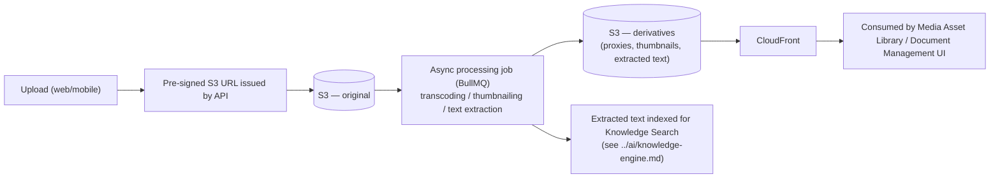

# Storage Strategy

How the four storage technologies chosen in [`../architecture/technology-stack.md`](../architecture/technology-stack.md) divide responsibility.

## Storage Systems and What Lives Where

| System | Stores | Why Not Elsewhere |
|---|---|---|
| PostgreSQL (relational) | Structured business data: CRM, projects, finance, governance entities (see [`data-model.md`](./data-model.md)) | Needs relational integrity, transactions, RLS |
| PostgreSQL (`pgvector`) | AI memory embeddings (see [`entity-relationship-diagram.md`](./entity-relationship-diagram.md)'s `MEMORY_CHUNK`) | Co-locating with relational data keeps RLS and backup coverage uniform — see [`../ai/memory-system.md`](../ai/memory-system.md) |
| Redis | Session cache, hot-read cache (KPI dashboards, seat profiles), background job queue | Needs low-latency ephemeral access; not durable system-of-record data |
| S3 | Media assets (video, images), documents, backups | Large binary objects don't belong in a relational database; S3 is durable, versioned, and cheap at scale |

## Media and Document Lifecycle

Uploads go directly from the client to S3 via a pre-signed URL (not proxied through the API) to avoid the API tier becoming a bottleneck for large video files — directly relevant to 360Sports and The Chairman's footage volumes.

## Storage Classification and Retention

Tied to [`data-governance.md`](./data-governance.md)'s classification tiers:

| Classification | Example | Retention |
|---|---|---|
| Public | Published 360Sports content, marketing assets | Indefinite, no special handling |
| Internal | Internal financial reports, meeting notes | Per [`docs/governance.md`](../../docs/governance.md) reporting cadence; retained indefinitely unless superseded |
| Confidential | Contracts, deal terms | Retained per legal requirement, access-logged |
| Restricted | RecoverHUB participant records | Minimum necessary retention, explicit deletion capability per data-subject request (see [`data-governance.md`](./data-governance.md)) |

## Backup Coverage

Every storage system above has a defined backup strategy in [`../architecture/disaster-recovery.md`](../architecture/disaster-recovery.md) — no system is exempted because it "just holds cache" (Redis job-queue state loss would drop in-flight background work, so it is monitored, even though it's not cross-region backed up like RDS/S3).

## AI-Specific Storage Consideration

`MEMORY_CHUNK` rows containing content sourced from Restricted-classification documents inherit that classification — the AI Workforce's retrieval layer (see [`../ai/knowledge-engine.md`](../ai/knowledge-engine.md)) respects the same RLS and classification rules as any other query, so a seat without authorization to view RecoverHUB participant data cannot retrieve it via RAG either. This closes an obvious gap: an AI memory system is not exempt from the access controls the rest of the platform enforces.
