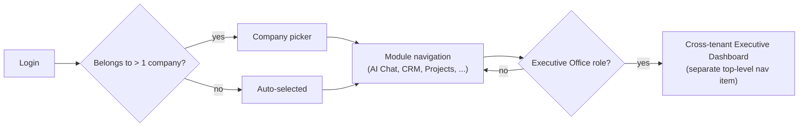

# Navigation

## Two Navigation Axes

The platform has two independent navigation dimensions that must never be conflated:

1. **Which tenant** (company/venture) am I working in? — see [`../database/data-model.md`](../database/data-model.md).
2. **Which module** within that tenant am I using? — the 9 [Bhubesi OS modules](../../projects/bhubesi-os/README.md).

## Module Navigation

Directly extends the `ModuleNav` component already built in the [Bhubesi OS prototype](../../projects/bhubesi-os/README.md): a horizontal pill row, with modules the user's role doesn't have access to shown disabled/hidden rather than erroring on click — role-aware navigation is a frontend concern that mirrors [`../api/authorization.md`](../api/authorization.md)'s backend rules, not a separate permission system.

## Role-Based Visibility

| User Type | Sees |
|---|---|
| Executive Office seat/human | All tenants they have cross-tenant access to (per [`../api/authorization.md`](../api/authorization.md)), plus the Executive Dashboard |
| Venture lead | Their tenant's full module set |
| Venture staff | Their tenant, modules relevant to their role (e.g., a facilitator sees limited Finance access) |
| Partner (future) | A narrow, explicitly-scoped view — likely a single shared document or report, not the full module nav |

## Mobile Navigation Pattern

Given "mobile-first," navigation is designed mobile-down, not desktop-up: a bottom tab bar for the 3–4 most-used modules per role (e.g., a RecoverHUB facilitator's most-used modules are likely CRM/participant records and Documents, not Finance), with a "more" overflow for the rest — rather than cramming all 9 modules into a mobile nav bar. See [`../mobile/mobile-architecture.md`](../mobile/mobile-architecture.md).

## Search as Navigation

The Knowledge Search module (see [`../ai/knowledge-engine.md`](../ai/knowledge-engine.md)) doubles as a navigation shortcut — a global search bar available from any screen, not confined to its own module page, since finding a specific document or decision quickly is often faster than navigating a menu tree.

## Breadcrumb and Context Persistence

The active tenant persists across module navigation within a session (via the `[company]` URL segment, per [`ui-architecture.md`](./ui-architecture.md)) — switching from CRM to Finance never silently drops which venture you were working in.
