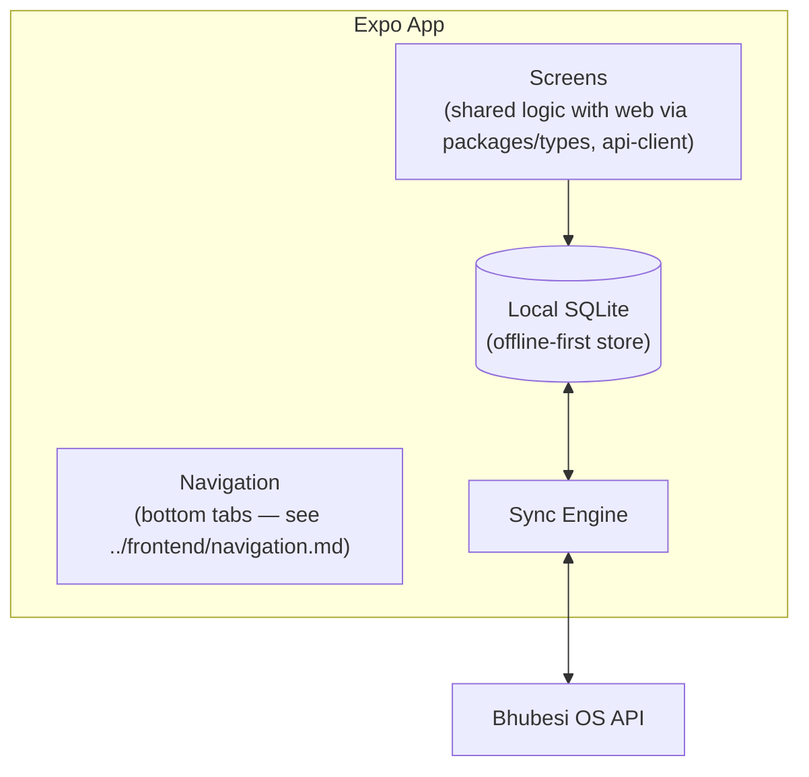

# Mobile Architecture

## Framework

React Native via Expo — justified in [`../architecture/technology-stack.md`](../architecture/technology-stack.md). This document covers the mobile app's internal structure.

## Why Mobile Is Not an Afterthought Here

"Mobile-first" is a stated principle for a concrete reason specific to this company, not a generic aspiration: RecoverHUB facilitators, 360Sports event-day crews, and The Chairman's production staff all do their primary work away from a desk, often in locations with unreliable connectivity. A web-only platform would fail its actual users. See [`offline-strategy.md`](./offline-strategy.md) for how this is addressed technically.

## App Structure

## Code Sharing with Web

Per [`../architecture/solution-architecture.md`](../architecture/solution-architecture.md)'s monorepo layout, the mobile app shares:

- `packages/types` — entity and API contract types (no duplicate type definitions).
- `packages/api-client` — the tRPC client, with the sync-aware wrapper described in [`offline-strategy.md`](./offline-strategy.md).
- `packages/ui` — component logic where React Native/NativeWind compatibility allows; screens themselves are mobile-specific (different layout needs than web), but business logic and data-fetching hooks are shared.

## Native Capabilities Used

| Capability | Use Case |
|---|---|
| Camera | Media capture for 360Sports event coverage, document scanning for RecoverHUB partner onboarding |
| Push notifications | Escalation alerts (e.g., RecoverHUB safeguarding events per [`../../projects/recoverhub/sops.md`](../../projects/recoverhub/sops.md) Section 5), Type 1 approval requests |
| Biometric authentication | Faster re-authentication after the session cache expires, without weakening the MFA posture in [`../api/authentication.md`](../api/authentication.md) |
| Background sync | Opportunistic data sync when connectivity briefly returns, without requiring the user to keep the app in the foreground |

## Distribution

- **App stores** (Apple App Store, Google Play) for the installable app itself.
- **Expo OTA updates** for JavaScript-layer changes (UI fixes, business logic changes) — ships in minutes without app-store review, critical for field teams who can't wait days for a store approval cycle when something is broken.
- **Android-first weighting** in QA priority — Android device share is materially higher than iOS across the African markets this platform targets; testing on low-to-mid-range Android hardware is a first-class QA requirement, not an edge case.

## Performance Budget

Given device diversity (many users on lower-end Android hardware) and data-cost sensitivity, the mobile app targets a materially smaller initial bundle and asset footprint than the web app would — lazy-loading modules a given user's role doesn't need at all (per [`../frontend/navigation.md`](../frontend/navigation.md)'s role-based visibility) rather than shipping all 9 modules' code to every device.

## Relationship to the Web App

The mobile app is not a lesser version of the web app for every module — some (Finance's detailed reporting, say) are reasonably web-primary/mobile-secondary, while others (Media capture, Document scanning, quick CRM updates) are genuinely mobile-primary. Module-by-module mobile scope is defined per release in [`../roadmap/`](../roadmap), not assumed to be full parity from day one.
