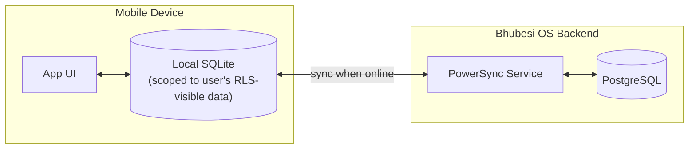

# Offline Strategy

## Why This Matters More Here Than in a Typical SaaS Product

"Offline capable where practical" is a named principle because connectivity in the markets this platform serves is genuinely intermittent, and mobile data is a real cost users bear — not a hypothetical edge case to handle gracefully as an afterthought. A RecoverHUB facilitator running a session in a low-signal area, or a 360Sports crew inside a stadium with saturated cellular capacity, must be able to keep working.

## Architecture: Local-First with Background Sync

**Decision: PowerSync (Postgres-native sync engine) over a local SQLite store on-device.**

| Option | Verdict | Why |
|---|---|---|
| PowerSync | **Chosen** | Syncs directly against the Postgres database already chosen in [`../architecture/technology-stack.md`](../architecture/technology-stack.md) — no separate backend-for-offline to build and maintain. Handles partial/scoped sync (a user only syncs the tenant and records their RLS policy allows, per [`../database/data-model.md`](../database/data-model.md)), which matters because we specifically don't want to sync Restricted-classification data (e.g., other participants' RecoverHUB records) to a device that could be lost or stolen. |
| WatermelonDB | Rejected | Solid offline-first library, but requires building a custom sync protocol against the backend from scratch — more work for a capability PowerSync provides out of the box against Postgres specifically. |
| Full custom sync (roll our own) | Rejected | Sync engines with correct conflict resolution are notoriously hard to get right; not a good use of a lean team's time when a proven option fits the existing stack. |

## What's Offline-Capable vs. What Requires Connectivity

| Capability | Offline? | Rationale |
|---|---|---|
| Viewing recently-synced CRM/project/document data | Yes | Core "keep working" requirement |
| Creating/editing records (CRM notes, project updates, participant intake forms) | Yes, queued for sync | The primary offline use case — data capture in the field |
| Media capture (photos, video for 360Sports/Chairman) | Yes, uploaded on reconnect | Large files queue for background upload rather than blocking |
| AI Chat with the AI Workforce | No | Requires a live LLM Gateway call (see [`../ai/ai-platform.md`](../ai/ai-platform.md)) — not meaningfully offline-capable without an on-device model, which isn't justified at this stage. The app should communicate this limitation clearly rather than failing silently. |
| Finance approvals (Type 1 decisions) | No | Approval actions require live authorization and audit logging (see [`../api/authorization.md`](../api/authorization.md)) — queuing a financial approval offline is a correctness and security risk, not just a UX inconvenience. |

## Conflict Resolution

**Decision: last-write-wins with a visible audit trail, not automatic merging.**

Justification: most of this platform's data (CRM notes, project status updates) doesn't have genuine concurrent-edit conflicts in practice — one facilitator "owns" a given participant record at a time, for instance. Last-write-wins with the losing write preserved in an audit log (per [`../database/entity-relationship-diagram.md`](../database/entity-relationship-diagram.md)'s pattern) is simple, predictable, and sufficient. If a genuinely collaborative-editing feature emerges later (e.g., shared meeting notes edited by multiple people simultaneously), that specific feature should adopt a CRDT-based approach (e.g., Yjs) rather than retrofitting the whole sync layer — this is a scoped, deferred decision, not a gap.

## Data Cost Minimization

- Sync payloads are delta-based (only changed records, not full re-sync) after initial setup.
- Media assets sync at reduced resolution by default on cellular connections, with a full-resolution upload deferred to Wi-Fi unless the user explicitly forces it — directly addressing the real mobile-data cost African users bear.
- Sync frequency is configurable per user, defaulting to opportunistic (on app foreground + periodic background) rather than constant real-time polling that drains both battery and data.

## Testing

Offline scenarios are tested explicitly (airplane-mode QA passes, simulated packet loss) before every mobile release, not assumed to work because "the sync library handles it."
