# Implementation Plan

## Sequencing Across Releases

```mermaid
gantt
    title Bhubesi OS Platform Roadmap (illustrative sequencing, not calendar-committed dates)
    dateFormat X
    axisFormat %s

    section MVP
    Monorepo migration + NestJS API      :m1, 0, 4w
    Auth + multi-tenancy foundation      :m2, after m1, 3w
    Real AI Chat (LLM Gateway live)      :m3, after m2, 4w
    Knowledge Engine + basic search      :m4, after m3, 3w
    Security + DR baseline               :m5, after m2, 4w

    section Version 1
    CRM module                           :v1a, after m4, 4w
    Project Management module            :v1b, after v1a, 3w
    Mobile app (first release)           :v1c, after v1b, 5w
    Offline sync (CRM + Documents)       :v1d, after v1c, 3w
    Google/Zoom integration              :v1e, after v1b, 2w

    section Version 2
    Finance module                       :v2a, after v1d, 5w
    Media Asset Library                  :v2b, after v2a, 4w
    Automation Hub (Workflow Engine)     :v2c, after v2a, 5w
    Full mobile parity + offline         :v2d, after v2b, 4w
    Payment integration                  :v2e, after v2a, 2w

    section Version 3
    Research Database                    :v3a, after v2c, 3w
    External partner API                 :v3b, after v3a, 4w
    Advanced agent orchestration         :v3c, after v2c, 5w
    SOC 2 readiness                      :v3d, after v3b, 6w
```

Durations are relative-sequencing estimates for planning discussion, not committed calendar dates — actual timing depends on team size, which is not yet fixed (see Team below).

## Team Requirements

| Stage | Minimum Team |
|---|---|
| MVP | 1 full-stack engineer (TypeScript/NestJS/Next.js) + [CTO seat](../../ai-agents/workforce/cto.md) as architect/reviewer — genuinely buildable by a very small team given the narrow scope |
| Version 1 | Add 1 mobile-capable engineer (React Native) |
| Version 2 | Add 1 backend-focused engineer (Finance/payments carry real correctness and audit stakes that benefit from a second set of eyes) |
| Version 3 | Team composition depends on which Version 3 items are prioritized — a partner-API push benefits from a dedicated integration engineer; a SOC 2 push benefits from external audit/compliance support rather than another engineer |

This is intentionally lean — consistent with [`../architecture/technology-stack.md`](../architecture/technology-stack.md)'s guiding constraint that every choice assumes a small team, not a fully staffed platform organization.

## Dependencies and Risks

| Risk | Mitigation |
|---|---|
| AI Gateway cost overruns as usage grows | Per-seat/per-tenant cost caps from day one (see [`../ai/ai-platform.md`](../ai/ai-platform.md)); reviewed against [`executive-brain/kpi-framework.md`](../../executive-brain/kpi-framework.md) financial KPIs monthly |
| Team capacity slips the sequencing above | Roadmap is explicitly modular — a delayed Version 2 module doesn't block Version 1 modules already shipped; see [`../architecture/solution-architecture.md`](../architecture/solution-architecture.md)'s module independence |
| A venture's real needs diverge from what's planned | Each roadmap stage's scope is validated against the relevant venture's actual `operations.md` document (already written — see [`../../projects/recoverhub/operations.md`](../../projects/recoverhub/operations.md) and equivalents) before build starts, not assumed from this document alone |
| Security/compliance gap discovered late | [`../architecture/security-architecture.md`](../architecture/security-architecture.md) and [`../database/data-governance.md`](../database/data-governance.md) are MVP-scope requirements, not deferred — this is the single most important sequencing decision in this plan |

## Governance

This implementation plan itself is reviewed at the same quarterly cadence as everything else (per [`executive-brain/quarterly-planning-framework.md`](../../executive-brain/quarterly-planning-framework.md)) — a roadmap that never gets revisited against real progress is not actually being used to plan.

## Decision Point

Adopting this plan (and the architecture it implements) is a Type 1 decision for the [CTO seat](../../ai-agents/workforce/cto.md), requiring CEO and Executive Office ratification per [`executive-brain/decision-framework.md`](../../executive-brain/decision-framework.md) — see the [CTO Report](../CTO-REPORT.md) for the summary recommendation this plan supports.
